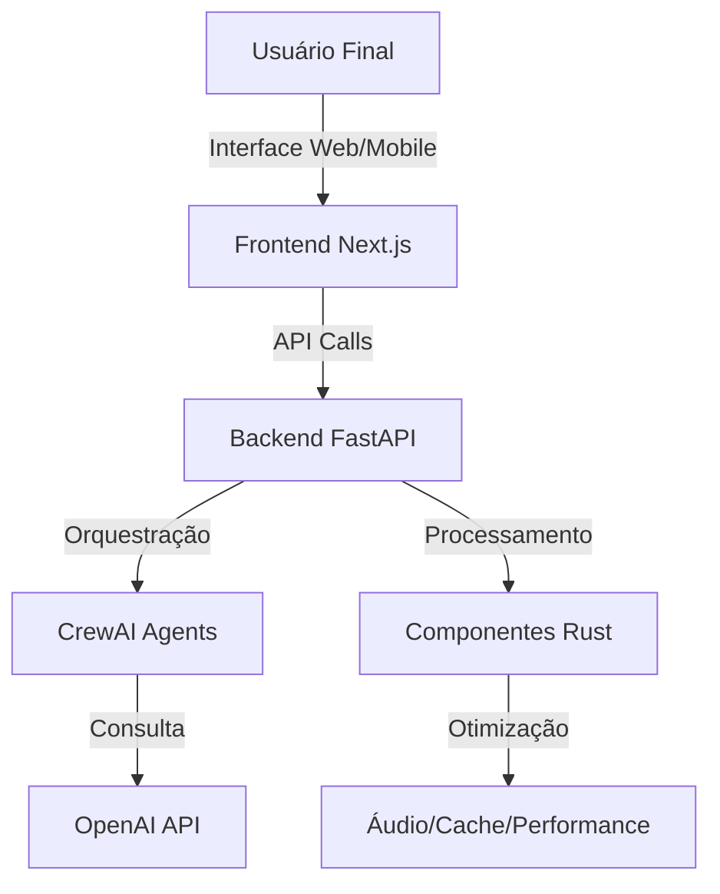

# Papo Social - Documentação

Bem-vindo à documentação oficial do Papo Social. Este projeto está seguindo uma abordagem documentation-first para garantir clareza e eficiência no desenvolvimento.

## Visão Geral

O Papo Social é uma plataforma de comunicação inteligente que utiliza agentes de IA orquestrados para proporcionar interações naturais com processamento avançado de voz.



## Índice

- [Planejamento](./planning/MVP_EVOLUTION.md)
- [Arquitetura](./architecture/OVERVIEW.md)
- [Stack Tecnológica](./architecture/TECH_STACK.md)
- [Modelo de Dados](./database/DATA_MODEL.md)
- [Contribuição](./CONTRIBUTING.md)
- [Primeiros Passos](./GETTING_STARTED.md)

## Por que Documentation-First? 

Nossa abordagem coloca a documentação como produto central no início do desenvolvimento:

1. **Clareza Compartilhada**: Todos entendem a visão do projeto
2. **Decisões Informadas**: Arquitetura planejada antes da implementação
3. **Redução de Retrabalho**: Menos código descartado
4. **Onboarding Eficiente**: Novos colaboradores entendem rapidamente o contexto
5. **Desenvolvimento Orientado**: Implementação guiada por documentação clara

## Próximos Passos

Para começar a contribuir, visite o [Guia de Primeiros Passos](./GETTING_STARTED.md).
```
## Links Rápidos

- [Demonstração](https://seu-usuario.github.io/papo-comtxae)
- [Repositório](https://github.com/seu-usuario/papo-comtxae)
