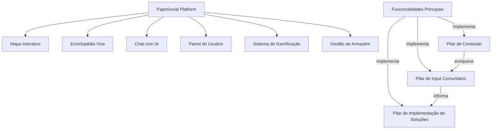
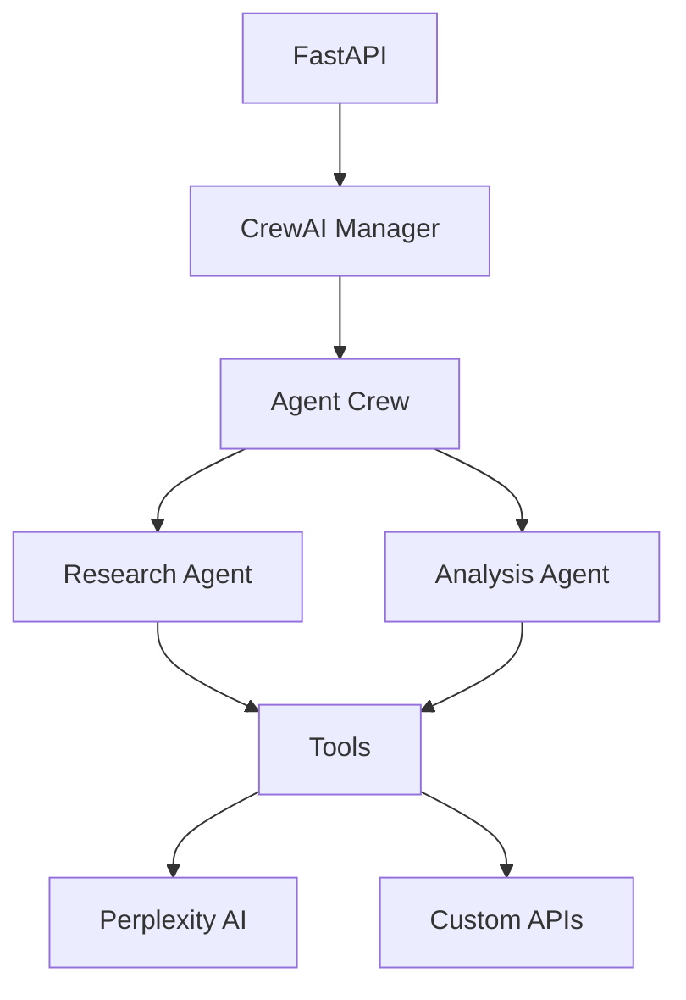
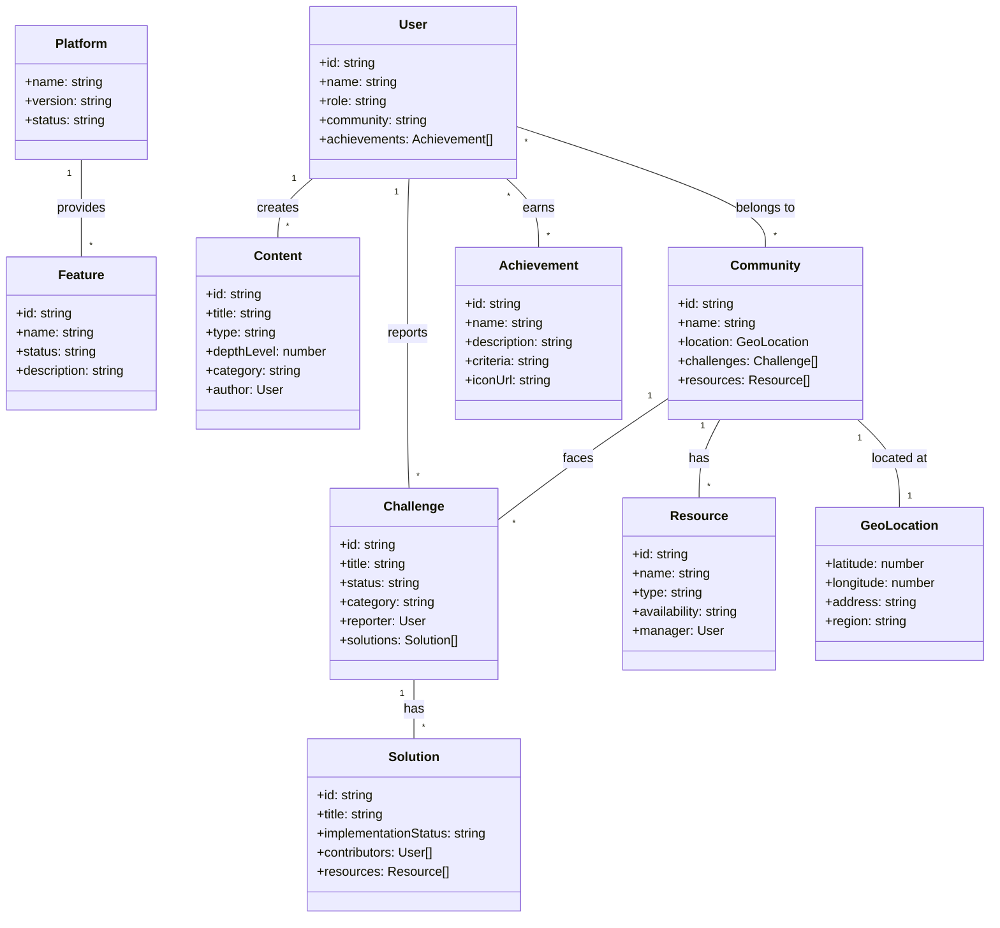
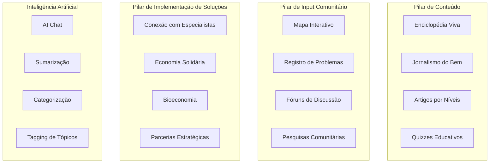
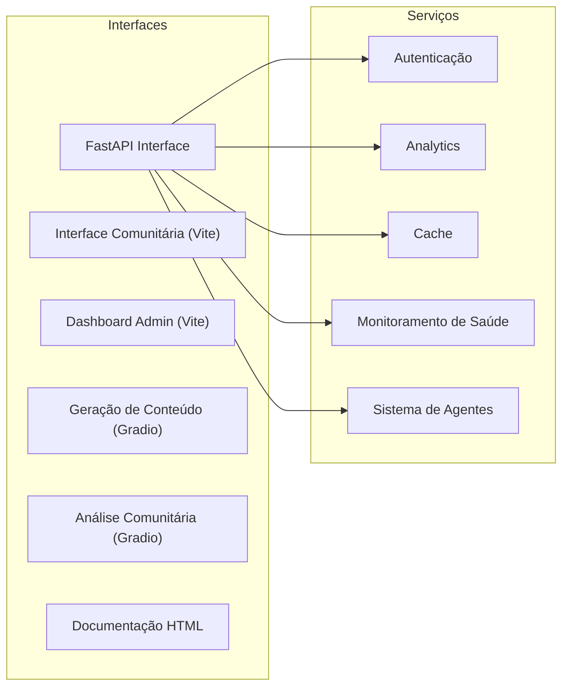
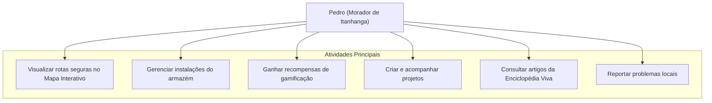
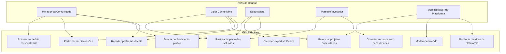
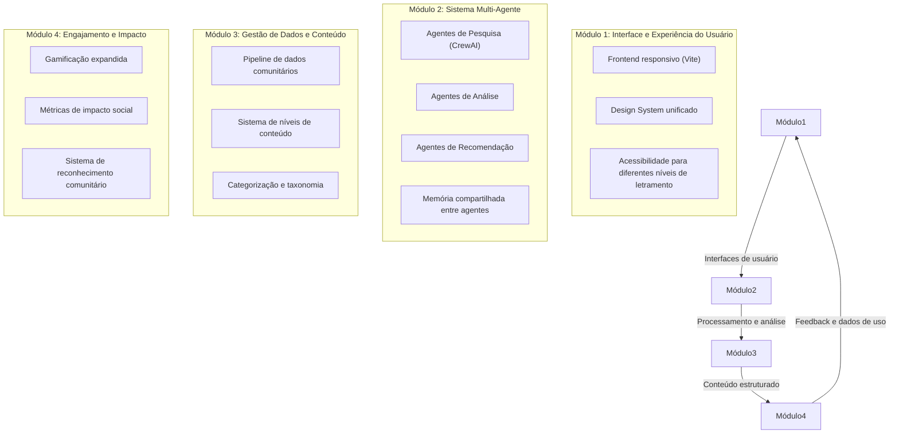

# Ontologia e Casos de Uso do PapoCrew/Papo Social

*Análise ontológica e direcionamento estratégico para o desenvolvimento do Papo Social*

## 1. Introdução e Visão Geral

### 1.1 Contextualização

O **Papo Social** é um ecossistema digital interativo que combina **informação de alto valor**, **engajamento comunitário** e **inteligência coletiva** para promover impacto social sustentável. Desenvolvido como parte do projeto **PapoCrew**, adota uma arquitetura multi-agente com foco em transformação social em comunidades vulneráveis, desde favelas no Rio de Janeiro até áreas rurais na Amazônia.

### 1.2 Visão e Propósito

**Visão**: Tornar-se uma referência global em desenvolvimento inclusivo, aproveitando tecnologia, colaboração e conhecimento compartilhado para elevar comunidades e promover sustentabilidade social e ambiental.

**Propósito**: Fomentar inovação orientada pela comunidade, onde as percepções e dados de cada morador possam influenciar políticas públicas e intervenções práticas.

**Missão**: Facilitar amplo acesso a informações relevantes e acionáveis, aproveitar expertise local e co-criar soluções que melhorem a qualidade de vida, sustentabilidade e justiça social em áreas carentes.

### 1.3 Objetivos deste Documento

Este documento visa:
1. Documentar a ontologia do sistema PapoCrew/Papo Social
2. Mapear os casos de uso principais por perfil de usuário
3. Estabelecer diretrizes para o desenvolvimento futuro
4. Fornecer questões específicas para refinamento da ontologia
5. Definir critérios para priorização dos casos de uso
6. Alinhar a implementação da arquitetura CrewAI com as necessidades do sistema

## 2. Visualização Atual do Projeto

### 2.1 Componentes Existentes

O PapoCrew atualmente está estruturado como um sistema multi-agente com foco em impacto social, implementando uma arquitetura CrewAI. A plataforma Papo Social integra:



### 2.2 Status da Implementação com CrewAI

```
PapoCrew2/
├── papocrew/
│   ├── api/
│   │   ├── main.py            ✅ Implementado
│   │   └── config.py          ✅ Implementado
│   ├── service/
│   │   ├── __init__.py        ✅ Implementado
│   │   ├── manager.py         ✅ Implementado
│   │   └── monitor.py         ✅ Implementado
│   └── agents/                🆕 Nova integração CrewAI
│       ├── __init__.py        ⏳ Pendente
│       ├── base.py            ⏳ Pendente
│       ├── crew.py            ⏳ Pendente
│       └── tools/             ⏳ Pendente
│           ├── research.py
│           └── analysis.py
```

### 2.3 Arquitetura de Integração CrewAI



### 2.4 Interfaces do Sistema

O sistema possui várias interfaces, cada uma com seu propósito específico:

- **FastAPI_Interface**: Backend API para gerenciamento de dados e integração
- **Next.js Interface**: Interface principal para membros da comunidade
- **Dashboard Admin (Vite)**: Painel administrativo para gestores comunitários
- **Gradio_Interface**: Interface para geração de conteúdo e análise comunitária
- **HTML_Documentation**: Hub central de documentação

## 3. Ontologia do Sistema

### 3.1 Entidades Principais



### 3.2 Pilares Funcionais do Sistema



### 3.3 Interfaces e Serviços



## 4. Casos de Uso por Perfil de Usuário

### 4.1 Caso de Uso: Morador da Comunidade (Pedro)



### 4.2 Casos de Uso por Perfil de Usuário



### 4.3 Detalhamento dos Perfis e Funcionalidades

| Perfil de Usuário | Descrição | Funcionalidades Principais | Objetivos |
|-------------------|-----------|---------------------------|-----------|
| **Morador da Comunidade** | Residentes locais com diferentes níveis de letramento e acesso digital | Mapa interativo, Enciclopédia Viva, Chat AI, Quizzes, Sistema de Badges | Reportar problemas, acessar conhecimento, contribuir com dados locais |
| **Líder Comunitário** | Representantes de associações, lideranças informais, coordenadores de iniciativas | Gerenciamento de projetos, Visualização agregada de dados, Fóruns de discussão | Coordenar ações coletivas, comunicar-se com moradores, planejar intervenções |
| **Especialista** | Profissionais técnicos, acadêmicos, consultores em áreas específicas | Contribuição de conteúdo especializado, Análise técnica de problemas, Mentoria | Oferecer conhecimento técnico, validar soluções, conectar-se com comunidades |
| **Parceiro/Investidor** | ONGs, empresas, órgãos públicos, investidores de impacto | Visão de oportunidades, Métricas de impacto, Conexões com projetos | Financiar iniciativas, fornecer recursos, estabelecer parcerias |
| **Administrador** | Gestores da plataforma, moderadores, equipe técnica | Painel administrativo, Ferramentas de moderação, Métricas de uso | Garantir funcionamento da plataforma, moderar conteúdo, analisar dados |

## 5. Direção de Desenvolvimento

### 5.1 Prioridades Imediatas (Camada Macro)

1. **Implementação completa do CrewAI** para dar suporte aos agentes que alimentarão:
   - Categorização automática de problemas reportados
   - Sugestões de soluções baseadas em casos anteriores
   - Curadoria de conteúdo para a Enciclopédia Viva

2. **Expansão das capacidades do Mapa Interativo** para incluir:
   - Visualização de camadas de dados (infraestrutura, segurança, recursos)
   - Integração com dados abertos de serviços públicos
   - Sistema de alertas para áreas críticas

3. **Desenvolvimento do sistema de recomendação** para conectar:
   - Problemas reportados com especialistas relevantes
   - Necessidades da comunidade com recursos disponíveis
   - Projetos semelhantes para compartilhamento de conhecimento

### 5.2 Estrutura de Desenvolvimento (Camada Meso)



### 5.3 Detalhes de Implementação (Camada Micro)

#### 5.3.1 Chat IA - Integração

- **Acesso Universal**: Embebido em todas as seções principais (Mapa, Enciclopédia, Painel)
- **Assistência Contextual**: Sugestões relevantes baseadas na localização do usuário na plataforma
- **Enriquecimento de Dados**: Sumarização, categorização e tagging automático
- **Privacidade e Moderação**: Armazenamento seguro e moderação de conteúdo sensível
- **Abordagem Técnica**: Começar com backend AI simples e escalar conforme necessidade

#### 5.3.2 Painel do Usuário - Layout de Cards

Para o Painel do Usuário, especialmente na visão de administrador/gestor, implementar cards informativos:

1. **Card "Atividade Recente"**
2. **Card "Bairros em Destaque"**
3. **Card "Conteúdos Mais Acessados"**
4. **Card "Solicitações de Moderação"**
5. **Card "Engajamento e Retenção"**
6. **Card "Alertas Importantes"**

## 6. Questões para Refinamento da Ontologia

### 6.1 Sobre Entidades

1. **Quais atributos adicionais são necessários para cada entidade?**
   - User: Precisamos incluir dados demográficos? Histórico de atividades? Preferências?
   - Content: Como modelar diferentes formatos (texto, vídeo, áudio)?
   - Challenge: Como classificar por urgência ou impacto?

2. **Existem subtipos específicos para certas entidades que devem ser modelados separadamente?**
   - Diferentes tipos de recursos comunitários (físicos, digitais, humanos)?
   - Categorias específicas de conteúdo da Enciclopédia Viva?
   - Tipos de desafios/problemas reportados no Mapa Interativo?

3. **Como modelamos a evolução temporal das entidades?**
   - Rastreamento de mudanças em desafios comunitários ao longo do tempo?
   - Histórico de contribuições de usuários?
   - Evolução de soluções desde proposta até implementação?

### 6.2 Sobre Relacionamentos

1. **Quais são as cardinalidades precisas entre as entidades?**
   - Quantos usuários podem gerenciar um recurso comunitário?
   - Um desafio pode pertencer a múltiplas comunidades?
   - Uma solução pode responder a múltiplos desafios?

2. **Existem restrições específicas em relacionamentos que precisam ser documentadas?**
   - Requisitos para que um usuário torne-se gestor de recursos?
   - Limitações na edição de conteúdo por diferentes perfis?
   - Condições para aprovação/rejeição de soluções propostas?

3. **Como modelamos relacionamentos temporários vs. permanentes?**
   - Participação de especialistas em projetos específicos?
   - Acesso temporário a recursos comunitários?
   - Envolvimento sazonal em iniciativas?

### 6.3 Sobre Regras de Negócio

1. **Quais são as regras para progressão de usuários no sistema de gamificação?**
   - Critérios para ganhar badges específicas?
   - Pontuação para diferentes tipos de contribuição?
   - Níveis de acesso baseados em reconhecimento na plataforma?

2. **Como definimos a visibilidade de conteúdo baseada em perfis de usuário?**
   - Quais conteúdos são públicos vs. restritos a certos perfis?
   - Como estabelecer permissões para edição em diferentes seções?
   - Critérios para destacar conteúdo na página inicial?

3. **Quais são as políticas de moderação de conteúdo gerado pela comunidade?**
   - Processo de aprovação para relatos no Mapa Interativo?
   - Fluxo de revisão para artigos na Enciclopédia Viva?
   - Critérios para remoção de conteúdo inadequado?

## 7. Questões para Priorização dos Casos de Uso

### 7.1 Critérios de Impacto

1. **Qual o número potencial de usuários beneficiados por cada caso de uso?**
   - Quantos moradores podem utilizar diretamente o Mapa Interativo?
   - Qual a abrangência geográfica/demográfica da Enciclopédia Viva?
   - Quantas pessoas se beneficiam da gestão eficiente de recursos comunitários?

2. **Qual o potencial de transformação social de cada funcionalidade?**
   - Como o Chat IA pode aumentar o acesso a conhecimento em áreas de baixa alfabetização?
   - De que forma o sistema de badges pode incentivar participação cívica?
   - Como o Mapa Interativo pode influenciar políticas públicas locais?

3. **Como medimos o retorno sobre investimento para cada componente?**
   - Métricas quantitativas: engajamento, número de problemas resolvidos, novos projetos
   - Métricas qualitativas: percepção de melhoria na qualidade de vida, empoderamento
   - Indicadores de sustentabilidade financeira para iniciativas geradas na plataforma

### 7.2 Critérios de Viabilidade

1. **Qual a complexidade técnica de implementação de cada caso de uso?**
   - Estimativa de recursos necessários (horas de desenvolvimento, especialidades)
   - Desafios técnicos específicos (integração de dados, escalabilidade, segurança)
   - Requisitos de infraestrutura e manutenção

2. **Quais dependências externas existem para cada componente?**
   - APIs de terceiros necessárias
   - Dados de fontes governamentais ou outras organizações
   - Parcerias institucionais necessárias

3. **Quanto tempo estimado é necessário para implementar cada funcionalidade?**
   - Timeline para desenvolvimento de MVP
   - Fases incrementais de implementação
   - Janelas para testes com usuários reais

### 7.3 Critérios Estratégicos

1. **Como cada caso de uso se alinha com a missão geral da plataforma?**
   - Contribuição para os objetivos de desenvolvimento inclusivo
   - Alinhamento com valores de colaboração e inteligência coletiva
   - Suporte à visão de transformação social sustentável

2. **Quais componentes têm maior potencial de expansão futura?**
   - Capacidade de escalar para outras comunidades/regiões
   - Potencial para novas funcionalidades derivadas
   - Flexibilidade para adaptar-se a diferentes contextos culturais

3. **Quais funcionalidades podem servir como MVP para validação rápida?**
   - Casos de uso com menor complexidade técnica e alto impacto
   - Componentes que demonstram o valor central da plataforma
   - Funcionalidades que podem gerar feedback significativo rapidamente

## 8. Planejamento da Implementação CrewAI

### 8.1 Definição dos Agentes

| Agente | Função | Capacidades | Ferramentas |
|--------|--------|-------------|-------------|
| **ResearchAgent** | Pesquisar informações e conteúdo relevante | Busca avançada, síntese, categorização | Perplexity AI, Web search, Knowledge databases |
| **AnalysisAgent** | Analisar dados comunitários e identificar padrões | Processamento estatístico, inferência, correlação | Data processing tools, Visualization libraries |
| **ContentAgent** | Gerar e curar conteúdo para a Enciclopédia Viva | Adaptação de nível linguístico, verificação de fatos | Language models, Educational content APIs |
| **ModerationAgent** | Revisar e moderar conteúdo gerado por usuários | Detecção de conteúdo inadequado, sensibilidade cultural | Content moderation APIs, Community guidelines |
| **RecommendationAgent** | Conectar pessoas, recursos e soluções | Matchmaking, priorização, personalização | Recommendation algorithms, Profile analysis |

### 8.2 Ferramentas e Integrações

1. **APIs e Fontes de Dados**:
   - API de dados geográficos para o Mapa Interativo
   - Integrações com fontes de dados públicos (IBGE, portais de transparência)
   - APIs de redes sociais para compartilhamento e distribuição de conteúdo

2. **Ferramentas Especializadas por Agente**:
   - Ferramentas de NLP para categorização de textos
   - Análise de sentimento para feedback comunitário
   - Processamento de imagens para identificar problemas em fotos enviadas

3. **Gestão de Acesso e Credenciais**:
   - Sistema de permissões granulares por agente
   - Rotação automática de chaves de API
   - Logs de auditoria para acessos a dados sensíveis

### 8.3 Fluxos de Trabalho

1. **Colaboração entre Agentes**:
   - ResearchAgent fornece insumos para ContentAgent
   - AnalysisAgent informa RecommendationAgent
   - ModerationAgent filtra dados antes de serem processados por outros agentes

2. **Protocolos de Comunicação**:
   - Formatos padronizados para troca de informações entre agentes
   - Sistema de priorização de tarefas
   - Mecanismos de solicitação/resposta síncronos e assíncronos

3. **Resolução de Conflitos**:
   - Sistema de votação ponderada para recomendações conflitantes
   - Escalada para revisão humana em casos de incerteza alta
   - Feedback loop para calibração contínua

### 8.4 Memória e Persistência

1. **Armazenamento de Histórico**:
   - Log de interações por sessão de usuário
   - Histórico de decisões dos agentes
   - Registro de feedback e ajustes

2. **Conhecimento Compartilhado**:
   - Base de conhecimento centralizada acessível a todos os agentes
   - Cache de informações frequentemente acessadas
   - Vetorização semântica para recuperação eficiente

3. **Aprendizado Incremental**:
   - Feedback de usuários para calibrar recomendações
   - Análise periódica de desempenho por agente
   - Atualização contínua da base de conhecimento

## 9. Próximos Passos

### 9.1 Cronograma de Desenvolvimento

1. **Fase 1: Refinamento da Ontologia** (2 semanas)
   - Responder às questões de refinamento levantadas
   - Validar com stakeholders e representantes da comunidade
   - Formalizar o modelo de dados final

2. **Fase 2: Implementação CrewAI Básica** (4 semanas)
   - Configurar ambiente de desenvolvimento
   - Implementar agentes de pesquisa e análise
   - Integrar com ferramentas e APIs essenciais

3. **Fase 3: Desenvolvimento de Frontend Prioritário** (6 semanas)
   - Implementar interfaces críticas (Mapa, Enciclopédia básica)
   - Integrar Chat IA nas interfaces principais
   - Criar Painel de Usuário essencial

4. **Fase 4: Testes com Usuários Reais** (2 semanas)
   - Sessões de teste com diferentes perfis de usuário
   - Coleta e análise de feedback
   - Ajustes baseados em experiência real

5. **Fase 5: Expansão e Refinamento** (Contínuo)
   - Implementação de funcionalidades secundárias
   - Ajuste fino do sistema de agentes
   - Expansão para novas comunidades

### 9.2 Métricas de Sucesso

| Categoria | Métrica | Meta | Método de Medição |
|-----------|---------|------|-------------------|
| **Engajamento** | Usuários mensais ativos | >500 no primeiro trimestre | Analytics da plataforma |
| **Engajamento** | Tempo médio na plataforma | >10 minutos por sessão | Analytics da plataforma |
| **Contribuição** | Relatos no Mapa Interativo | >50 por semana | Contagem na base de dados |
| **Contribuição** | Participação em fóruns/discussões | >20% dos usuários ativos | Analytics da plataforma |
| **Impacto** | Problemas comunitários resolvidos | >10 no primeiro semestre | Rastreamento na plataforma |
| **Impacto** | Projetos iniciados via plataforma | >5 no primeiro semestre | Rastreamento na plataforma |
| **Técnicas** | Precisão do Chat IA | >85% de respostas úteis | Avaliação por feedback |
| **Técnicas** | Tempo de resposta do sistema | <2 segundos em 95% dos casos | Monitoramento de performance |

### 9.3 Pontos de Verificação

1. **Verificação de Requisitos** (Final da Fase 1)
   - Todos os requisitos funcionais são tecnicamente viáveis?
   - O modelo de dados suporta todos os casos de uso prioritários?

2. **Revisão de Arquitetura** (Meio da Fase 2)
   - A integração CrewAI está funcionando conforme esperado?
   - O sistema de agentes demonstra comportamento consistente?

3. **Avaliação de UX** (Final da Fase 3)
   - As interfaces são acessíveis para diferentes níveis de letramento?
   - O fluxo de navegação é intuitivo para os diferentes perfis?

4. **Validação com Comunidades** (Durante Fase 4)
   - O sistema resolve problemas reais das comunidades-alvo?
   - Existem barreiras não previstas para adoção?

5. **Análise de Escalabilidade** (Início da Fase 5)
   - O sistema pode escalar para mais usuários sem degradação?
   - Quais componentes precisam de otimização?

---

*Última atualização: 24 de fevereiro de 2025*

*Autor: PapoCrew Team*
