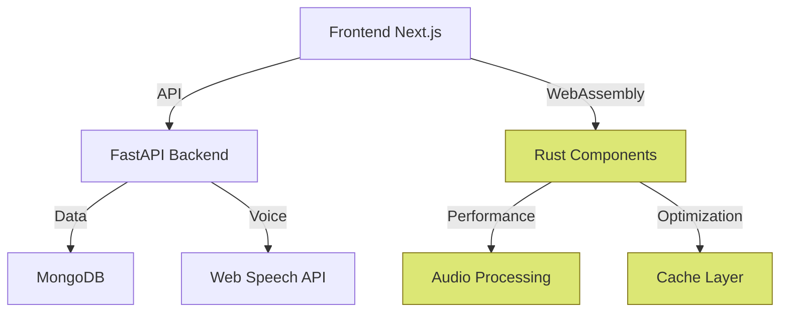

# 📊 Project Structure Analysis - Papo ComTxAE

## Current Project Structure
```
papo-comtxae/
├── src/
│   ├── frontend/         # Next.js TypeScript Application
│   │   ├── components/   ✅ Core UI Components
│   │   ├── pages/       ✅ Next.js Routes
│   │   └── public/      🔲 Static Assets
│   ├── backend/         # FastAPI Python Backend
│   │   ├── models/      ✅ Data Models
│   │   ├── config/      ✅ Configuration
│   │   ├── scripts/     ✅ Utility Scripts
│   │   └── main.py      ✅ Entry Point
│   └── rust_core/       # Future Rust Components
│       ├── audio/       🆕 Audio Processing
│       └── cache/       🆕 Performance Cache
├── docs/                # Project Documentation
│   ├── analysis/        ✅ Project Analysis
│   ├── architecture/    ✅ Technical Design
│   ├── database/        ✅ Data Models
│   ├── planning/        ✅ Project Roadmap
│   └── setup/          ✅ Setup Guides
```

## Architecture Overview


## Core Components

1. 🌐 Frontend Layer
   - Next.js 14+ with TypeScript
   - Tailwind CSS for styling
   - SWR for state management
   - WebAssembly integration
   - Voice input/output capabilities

2. 🔧 Backend Services
   - FastAPI for main API
   - MongoDB for data persistence
   - Pydantic for data validation
   - Environment management
   - Script automation

3. ⚡ Performance Core (Planned)
   - Rust components for critical operations
   - Audio processing pipeline
   - High-performance cache
   - WebAssembly compilation

## Implementation Status

### MVP1 (Current)
- ✅ Next.js frontend foundation
- ✅ FastAPI backend setup
- ✅ Basic voice interface
- ✅ MongoDB integration
- 🚧 Core features development

### MVP2 (Planned)
- 🔲 Rust core integration
- 🔲 WebAssembly modules
- 🔲 Advanced audio processing
- 🔲 Performance optimizations

### MVP3 (Future)
- 🔲 Scalability improvements
- 🔲 Full Rust/WASM pipeline
- 🔲 Advanced monitoring
- 🔲 Production optimizations

## Development Workflow
1. Frontend development with TypeScript/Next.js
2. Backend API implementation in FastAPI
3. Database models and migrations
4. Integration of Rust components
5. Testing and optimization
6. Documentation updates

*Last Updated: 2025-02-28 07:32 UTC-3*
