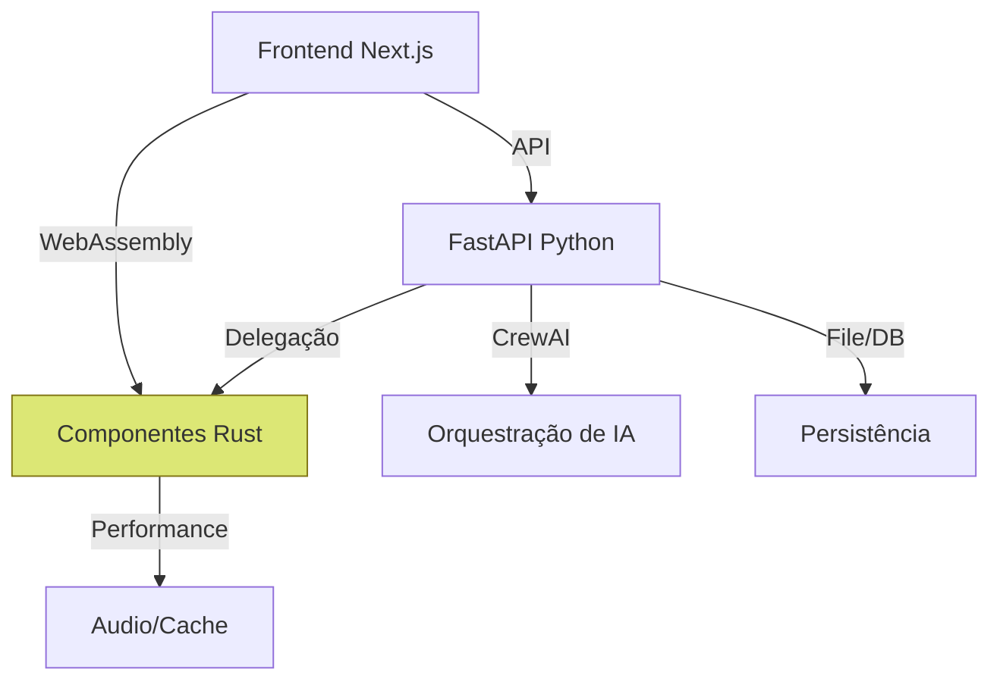

# Visão Geral da Arquitetura 

## Estrutura do Projeto 

```
papo-comtxae/
├── docs/              # Documentação
├── src/               # Código fonte (futuro)
│   ├── frontend/      # Código Next.js/React
│   ├── backend/       # API FastAPI (Python)
│   └── rust_core/     # Componentes críticos em Rust
└── README.md          # Documentação raiz
```

## Stack Técnica Planejada

### MVP 1 (Python/JavaScript)
- Frontend: React/Next.js + TypeScript + Tailwind CSS
- Backend: FastAPI (Python)
- Persistência: Sistema de arquivos (JSON)
- AI: OpenAI API + CrewAI

### MVP 2-3 (Introdução de componentes Rust)
- Componentes de alta performance em Rust
- Processamento de voz/áudio
- Operações de cache críticas
- WebAssembly para processamento no cliente

### Diagrama de Arquitetura Evoluída



Para detalhes completos sobre o stack tecnológico e a abordagem híbrida Python/Rust, consulte [Stack Tecnológica](TECH_STACK.md).
