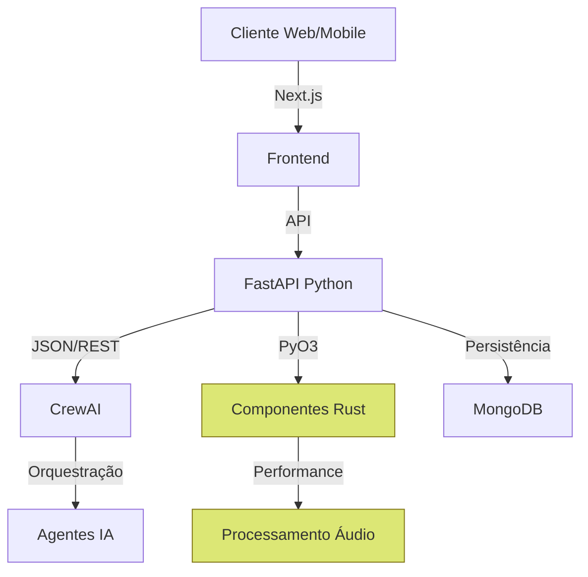

# Stack Tecnológica  

## Visão Geral 

O Papo Social utiliza uma abordagem híbrida de linguagens de programação e frameworks para aproveitar os pontos fortes de cada tecnologia:

1. **Python**: Orquestração de IA, lógica principal de backend
2. **TypeScript/JavaScript**: Interface de usuário e interações
3. **Rust**: Componentes críticos e processamento de alta performance

Esta combinação nos permite um desenvolvimento rápido e flexível, mantendo alta performance em áreas críticas.

## Stack por Camada

### Frontend

| Tecnologia | Função | Justificativa |
|------------|--------|---------------|
| Next.js 14+ | Framework React | SSR, rotas, optimizações automáticas |
| TypeScript | Linguagem | Tipagem, escalabilidade, DX |
| Tailwind CSS | Estilização | Desenvolvimento rápido, consistência |
| SWR | Gerenciamento de estado/cache | Stale-while-revalidate para UX fluida |
| WebAssembly | Processamento no cliente | Performance nativa para áudio/voz |
| Web Speech API | Entrada/saída de voz | API nativa para reconhecimento inicial |

### Backend

| Tecnologia | Função | Justificativa |
|------------|--------|---------------|
| FastAPI | Framework Python | Alto desempenho, tipagem, doc automática |
| CrewAI | Orquestração de agentes | Framework para agentes autônomos |
| Pydantic | Validação de dados | Integração nativa com FastAPI |
| MongoDB | Banco de dados principal | Flexibilidade de schema, escalabilidade |
| SQLite (MVP inicial) | Armazenamento inicial | Simplicidade, zero configuração |

### Componentes Críticos (Rust)

| Tecnologia | Função | Justificativa |
|------------|--------|---------------|
| Rust | Linguagem | Performance, segurança de memória |
| Tokio | Runtime assíncrono | Manipulação eficiente de I/O |
| WebAssembly | Compilação para web | Execução no navegador sem perda de performance |
| Actix-web | APIs em Rust | Exposição de serviços Rust quando necessário |

## Abordagem Híbrida Python-Rust

Nossa arquitetura integra Python e Rust através de:

1. **PyO3**: Bindings Python/Rust para funções críticas
2. **Processos separados**: Comunicação via IPC para isolamento
3. **Microserviços**: APIs Rust específicas para componentes críticos

## Decisões e Trade-offs

### Por que FastAPI e não Flask/Django?

FastAPI oferece:
- Performance próxima de Node.js/Go
- Validação automática de dados via Pydantic
- Documentação OpenAPI automática
- Suporte nativo a tarefas assíncronas

### Por que Next.js e não SvelteKit/Vue?

Next.js oferece:
- Ecossistema React maduro
- SSR otimizado
- Facilidade de build para produção
- App Router para organização lógica

### Por que componentes Rust?

Componentes específicos em Rust para:
- Processamento de áudio com latência mínima
- Algoritmos de alto desempenho
- Trabalho com memória de forma eficiente
- Compilação para WebAssembly quando necessário

### Por que MongoDB inicialmente?

- Schema flexível para iteração rápida
- Fácil modelagem de dados hierárquicos (conversas, mensagens)
- MongoDB Atlas com tier gratuito para MVP
- Performance adequada para cargas iniciais

## Ferramentas de Desenvolvimento

| Categoria | Ferramentas |
|-----------|-------------|
| Linting/Formatação | ESLint, Prettier, Black, Rustfmt |
| CI/CD | GitHub Actions |
| Teste | Jest, pytest, Rust test framework |
| Documentação | Docsify, TypeDoc, Pydoc, Rustdoc |
| Monitoramento | Prometheus, Grafana (futuro) |

## Evolução do Stack

### MVP1: Base Sólida
- FastAPI + MongoDB + Next.js
- Sem componentes Rust iniciais
- Processamento de áudio via Web APIs

### MVP2: Introdução de Performance
- Primeiros componentes Rust para processamento de áudio
- Exportação para WebAssembly
- Integração via PyO3 para backend

### MVP3: Escalabilidade
- Cluster MongoDB completo
- Otimização de componentes críticos em Rust
- Pipeline de áudio completa em Rust/WASM

## Requisitos de Ambiente

### Desenvolvimento
- Node.js 18+
- Python 3.9+
- Rust 1.70+ (quando necessário)
- MongoDB local ou Atlas

### Produção
- Servidor Linux (Ubuntu LTS recomendado)
- 2+ CPUs, 4GB+ RAM
- MongoDB Atlas ou cluster gerenciado
- Armazenamento apropriado para áudio
