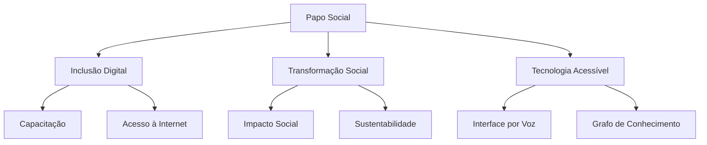

# Papo Social - Descrição do Projeto

## Visão Geral

O Papo Social é uma plataforma inovadora que visa conectar e empoderar comunidades através de tecnologia acessível e inclusiva.

## Objetivos

## Público-Alvo

1. Comunidades da Amazônia
2. Favelas do Rio de Janeiro
3. Áreas com acesso limitado à internet

## Parceiros Estratégicos

| Parceiro | Função |
|----------|---------|
| Cruz Vermelha | Suporte humanitário |
| Carteiro Amigo | Logística |
| ONGs Locais | Implementação |

## Próximos Passos

- [Plano de Desenvolvimento](../planning/DEVELOPMENT_PLAN.md)
- [Matriz de Monetização](monetization_matrix.md)
- [Matrizes Revolucionárias](../matrices/revolutionary_matrices.md)
