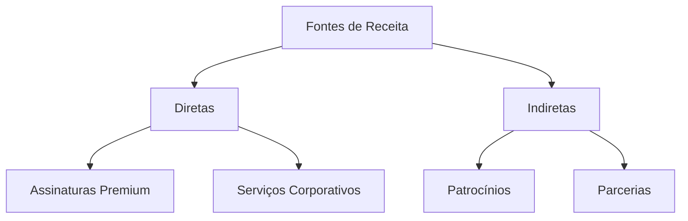

# Matriz de Monetização

## Visão Geral

A matriz de monetização do Papo Social é baseada em um modelo sustentável que equilibra impacto social e viabilidade financeira.

## Matriz

## Modelos de Receita

| Modelo | Descrição | Potencial |
|--------|-----------|-----------|
| Premium | Recursos avançados | Alto |
| Corporativo | Soluções B2B | Médio |
| Patrocínios | Apoio institucional | Alto |
| Parcerias | Revenue share | Médio |

## Validação

- [Próximos Passos](../planning/NEXT_STEPS.md)
- [Voltar para Descrição](PapoSocial_description.md)
- [Plano MVP](../MVP_PLAN.md)
