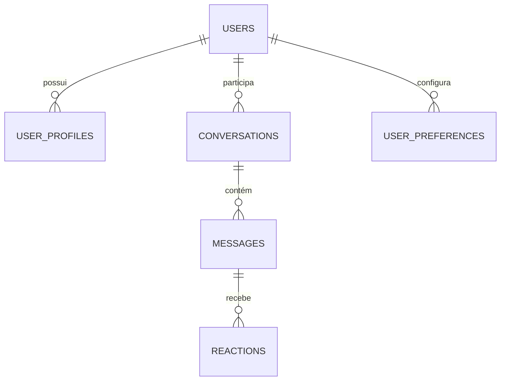

# Arquitetura de Dados do Papo Social 

## Princípios de Modelagem

O design da nossa arquitetura de dados segue os seguintes princípios:

1. **Escalabilidade Planejada**: Modelo que inicia simples mas permite crescimento
2. **Flexibilidade Estrutural**: Schema flexível para evolução contínua
3. **Performance Primeiro**: Otimizado para leitura e queries frequentes
4. **Governança de Dados**: Políticas claras sobre ciclo de vida dos dados

## Escolha de Banco de Dados: MongoDB

Para o MVP e desenvolvimento inicial, selecionamos **MongoDB** pelas seguintes razões:

### Vantagens para o Projeto

1. **Schema Flexível**: Ideal para fase inicial onde o modelo de dados evolui rapidamente
2. **Documentos JSON**: Alinha-se naturalmente com APIs REST e formato de dados JavaScript
3. **Escalabilidade Horizontal**: Permite crescimento sem redesenho da arquitetura
4. **Comunidade e Ferramentas**: Ecossistema maduro com boas ferramentas de visualização
5. **MongoDB Atlas**: Opção cloud gerenciada com tier gratuito para MVP

### Considerações Futuras

À medida que o projeto evolui, podemos:
- Adicionar Redis para cache e dados em tempo real
- Implementar PostgreSQL para queries complexas e relações estruturadas
- Explorar soluções de vetor para embeddings de IA (ativa ou Pinecone)

## Modelagem de Dados

### Coleções Principais



### 1. Users

```json
{
  "_id": "ObjectId",
  "email": "string",
  "auth_method": "string",  // "email", "google", "apple"
  "password_hash": "string", // Apenas se auth_method = "email"
  "verified": "boolean",
  "status": "string", // "active", "suspended", "deleted"
  "created_at": "date",
  "last_login": "date",
  "analytics": {
    "total_sessions": "number",
    "avg_session_time": "number",
    "devices": ["string"]
  }
}
```

### 2. UserProfiles

```json
{
  "_id": "ObjectId",
  "user_id": "ObjectId",
  "display_name": "string",
  "full_name": "string",
  "bio": "string",
  "avatar_url": "string",
  "location": {
    "city": "string",
    "state": "string",
    "country": "string"
  },
  "interests": ["string"],
  "updated_at": "date"
}
```

### 3. Conversations

```json
{
  "_id": "ObjectId",
  "title": "string",
  "type": "string", // "personal", "assistant", "group"
  "participants": ["ObjectId"],
  "created_at": "date",
  "updated_at": "date",
  "status": "string", // "active", "archived"
  "metadata": {
    "context": "string",
    "tags": ["string"],
    "summary": "string"
  }
}
```

### 4. Messages

```json
{
  "_id": "ObjectId",
  "conversation_id": "ObjectId",
  "sender_id": "ObjectId",
  "content": {
    "text": "string",
    "attachments": [{
      "type": "string",
      "url": "string",
      "metadata": "object"
    }],
    "is_voice_generated": "boolean"
  },
  "sent_at": "date",
  "read_by": [{
    "user_id": "ObjectId",
    "timestamp": "date"
  }],
  "metadata": {
    "sentiment": "string",
    "intent": "string",
    "ai_processed": "boolean",
    "voice_data": {
      "duration": "number",
      "wpm": "number"
    }
  }
}
```

### 5. UserPreferences

```json
{
  "_id": "ObjectId",
  "user_id": "ObjectId",
  "notification_settings": {
    "new_message": "boolean",
    "mentions": "boolean",
    "system": "boolean"
  },
  "voice_settings": {
    "auto_transcribe": "boolean",
    "voice_feedback": "boolean",
    "preferred_voice": "string"
  },
  "privacy_settings": {
    "profile_visibility": "string",
    "online_status": "string",
    "data_sharing": "string"
  },
  "ui_settings": {
    "theme": "string",
    "language": "string",
    "accessibility": {
      "text_size": "string",
      "contrast": "string"
    }
  },
  "updated_at": "date"
}
```

## Estratégia de Indexação

### Índices Primários

```js
// Users
db.users.createIndex({ "email": 1 }, { unique: true })
db.users.createIndex({ "status": 1, "created_at": -1 })

// Conversations
db.conversations.createIndex({ "participants": 1 })
db.conversations.createIndex({ "updated_at": -1 })

// Messages
db.messages.createIndex({ "conversation_id": 1, "sent_at": -1 })
db.messages.createIndex({ "sender_id": 1, "sent_at": -1 })
```

### Índices Compostos e Especiais

```js
// Para busca de mensagens por conteúdo
db.messages.createIndex({ "content.text": "text" })

// Para filtragem de conversas por participante e data
db.conversations.createIndex({ "participants": 1, "updated_at": -1 })

// Para análises de usuários
db.users.createIndex({ "analytics.total_sessions": -1 })
```

## Estratégia de Backup e Recuperação

1. **Backups Automatizados**:
   - Tier gratuito do MongoDB Atlas: Daily backups retidos por 7 dias
   - Tier pago: Point-in-time recovery

2. **Estratégia de Exportação**:
   - Script semanal para export local via `mongodump`
   - Armazenamento em múltiplas localizações

3. **Disaster Recovery**:
   - RTO (Recovery Time Objective): 4 horas
   - RPO (Recovery Point Objective): 24 horas (gratuito), 1 hora (pago)

## Migração e Evolução

A abordagem para evolução de schema será:

1. **Migrations como Código**:
   - Scripts versionados para cada alteração de schema
   - Testes automatizados de migrations

2. **Estratégia de Atualização**:
   - Migrations background para collections grandes
   - Updates em lote para minimizar impacto

3. **Backwards Compatibility**:
   - Código que lida com múltiplas versões de schema
   - Período de transição para mudanças significativas

## Setup Inicial para o MVP

```bash
# Instruções para iniciar MongoDB local
docker run -d -p 27017:27017 --name mongodb -e MONGO_INITDB_ROOT_USERNAME=admin -e MONGO_INITDB_ROOT_PASSWORD=password mongo

# Criar database e usuário para a aplicação
docker exec -it mongodb mongosh --authenticationDatabase admin -u admin -p password --eval "
  use papo_social;
  db.createUser({
    user: 'app_user',
    pwd: 'app_password',
    roles: [{ role: 'readWrite', db: 'papo_social' }]
  });
"

# Verificar conexão
docker exec -it mongodb mongosh --authenticationDatabase papo_social -u app_user -p app_password --eval "db.stats()"
```

Para MongoDB Atlas (recomendado para MVP):

1. Criar conta em [MongoDB Atlas](https://www.mongodb.com/cloud/atlas)
2. Configurar cluster gratuito
3. Configurar Network Access para permitir conexões
4. Criar usuário de banco de dados
5. Obter string de conexão e atualizar arquivo `.env`

## Monitoramento e Analytics

1. **Performance**:
   - MongoDB Atlas Metrics (gratuito)
   - Índices de lentidão via logs
   
2. **Utilização**:
   - Tamanho por collection
   - Queries mais frequentes

3. **Alertas**:
   - Latência acima do normal
   - Crescimento inesperado
   - Erros de conexão

## Conclusão

Esta arquitetura de dados:
- Começa simples mas com estrutura para crescimento
- Prioriza flexibilidade sem sacrificar desempenho
- Estabelece práticas claras de governança
- Permite evolução orgânica conforme feedback dos usuários

Ao implementar MongoDB desde o MVP, garantimos que o banco de dados seja um ativo valioso desde o início, acumulando dados estruturados que informarão decisões futuras de produto e negócio.
