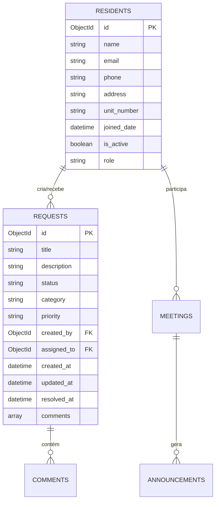

# Referência MongoDB - Papo Social

## 1. Introdução e Configuração

### Visão Geral
O Papo Social utiliza MongoDB como banco de dados principal, escolhido por sua:
- Flexibilidade de schema
- Boa integração com APIs REST
- Escalabilidade horizontal
- Suporte robusto para dados em tempo real

### Configuração do Ambiente

#### Variáveis de Ambiente Necessárias
```env
MONGODB_URL=sua_string_conexao_mongodb
DB_NAME=papo_social_db  # default
```

#### Inicialização da Conexão
```python
# Exemplo usando motor (async)
from motor.motor_asyncio import AsyncIOMotorClient

client = AsyncIOMotorClient(MONGODB_URL)
database = client[DB_NAME]
```

#### Verificação de Conexão
```python
async def test_connection():
    try:
        await client.admin.command('ping')
        return True
    except Exception as e:
        print("[ERRO] Falha na conexão:", str(e))
        return False
```

## 2. Estrutura do Banco de Dados

### Coleções Principais

- `residents`: Moradores e usuários do sistema
- `requests`: Solicitações e chamados
- `meetings`: Reuniões e assembleias
- `announcements`: Avisos e comunicados

### Diagrama ER



### Índices Principais

```javascript
// Residents
db.residents.createIndex({ "email": 1 }, { unique: true })
db.residents.createIndex({ "unit_number": 1 })

// Requests
db.requests.createIndex({ "created_by": 1 })
db.requests.createIndex({ "status": 1, "created_at": -1 })
db.requests.createIndex({ "category": 1 })
```

## 3. Modelos de Dados

### ResidentModel
```python
class ResidentModel(BaseModel):
    id: Optional[PydanticObjectId] = Field(default=None, alias="_id")
    name: str
    email: EmailStr
    phone: str
    address: str
    unit_number: str
    joined_date: datetime = Field(default_factory=datetime.now)
    is_active: bool = True
    role: str = "resident"
```

Exemplo de documento:
```json
{
    "_id": ObjectId("..."),
    "name": "João Silva",
    "email": "joao@exemplo.com",
    "phone": "11999998888",
    "address": "Rua Principal",
    "unit_number": "102A",
    "joined_date": ISODate("2024-02-27T19:35:57.000Z"),
    "is_active": true,
    "role": "resident"
}
```

### RequestModel
```python
class RequestModel(BaseModel):
    id: Optional[PydanticObjectId] = Field(default=None, alias="_id")
    title: str
    description: str
    status: str = "pending"
    category: str
    priority: str = "medium"
    created_by: PydanticObjectId
    assigned_to: Optional[PydanticObjectId] = None
    created_at: datetime
    updated_at: datetime
    resolved_at: Optional[datetime] = None
    comments: List[dict] = []
```

Exemplo de documento:
```json
{
    "_id": ObjectId("..."),
    "title": "Vazamento na garagem",
    "description": "Há um vazamento de água próximo à vaga 15",
    "status": "pending",
    "category": "maintenance",
    "priority": "high",
    "created_by": ObjectId("6079d5c3b98f5a8e7a51a973"),
    "created_at": ISODate("2024-02-27T19:35:57.000Z"),
    "updated_at": ISODate("2024-02-27T19:35:57.000Z"),
    "comments": []
}
```

## 4. Operações Comuns

### Queries Básicas

```python
# Buscar morador por email
resident = await residents_collection.find_one({"email": email})

# Listar solicitações pendentes
pending = await requests_collection.find(
    {"status": "pending"}
).sort("created_at", -1).to_list(length=50)

# Atualizar status de solicitação
await requests_collection.update_one(
    {"_id": request_id},
    {
        "$set": {
            "status": new_status,
            "updated_at": datetime.now()
        }
    }
)
```

### Agregações

```python
# Contagem de solicitações por categoria
pipeline = [
    {"$group": {
        "_id": "$category",
        "count": {"$sum": 1}
    }},
    {"$sort": {"count": -1}}
]
stats = await requests_collection.aggregate(pipeline).to_list(length=None)
```

## 5. Boas Práticas e Padrões

### Convenções de Nomenclatura
- Collections: plural, snake_case
- Campos: snake_case
- IDs: usar ObjectId do MongoDB
- Datas: sempre em UTC usando ISODate

### Validações
- Usar Pydantic para validação de schema
- Implementar validações de negócio na camada de serviço
- Manter consistência entre validações frontend e backend

### Performance
- Limitar tamanho de queries e resultados
- Usar projeções para retornar apenas campos necessários
- Criar índices para queries frequentes
- Monitorar slow queries

## 6. Backup e Manutenção

### Backup
- MongoDB Atlas: Backups automáticos diários
- Exportação manual: `mongodump --uri="<MONGODB_URL>"`
- Restore: `mongorestore --uri="<MONGODB_URL>" dump/`

### Monitoramento
- Verificar logs de erro
- Monitorar performance de queries
- Acompanhar uso de recursos
- Configurar alertas no MongoDB Atlas

### Healthcheck
```python
async def check_database_health():
    try:
        await client.admin.command('ping')
        collections = await database.list_collection_names()
        indexes = await database.residents.list_indexes()
        return {
            "status": "healthy",
            "collections": len(collections),
            "indexes": len(list(indexes))
        }
    except Exception as e:
        return {"status": "unhealthy", "error": str(e)}
```

## 7. Referências e Links Úteis

### Documentação Oficial
- [MongoDB Manual](https://docs.mongodb.com/manual/)
- [Motor AsyncIO](https://motor.readthedocs.io/)
- [MongoDB Atlas](https://docs.atlas.mongodb.com/)

### Ferramentas Recomendadas
- MongoDB Compass (GUI)
- Studio 3T (GUI Avançada)
- mongosh (CLI moderna)

### Recursos de Aprendizado
- [MongoDB University](https://university.mongodb.com/)
- [MongoDB Developer Center](https://mongodb.com/developer/)
- [PyMongo Tutorial](https://pymongo.readthedocs.io/en/stable/tutorial.html)
