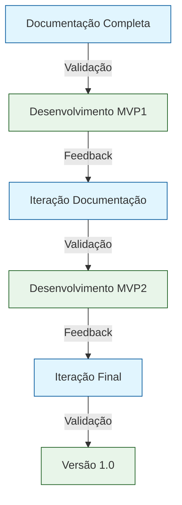
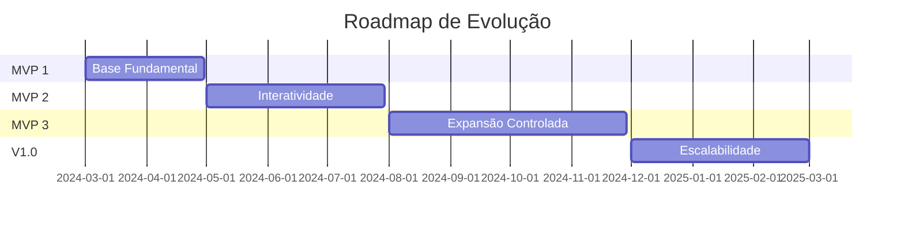
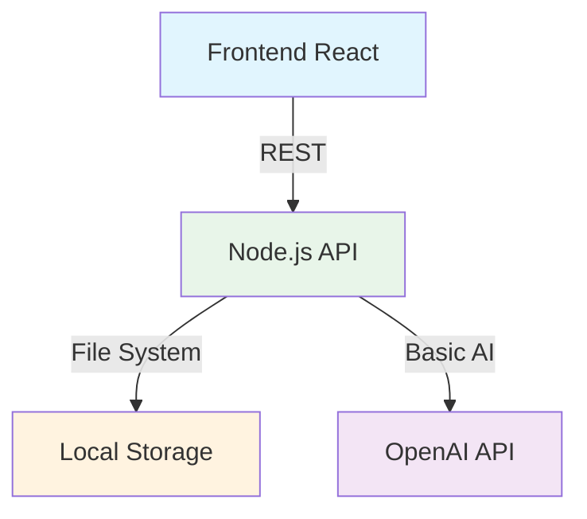
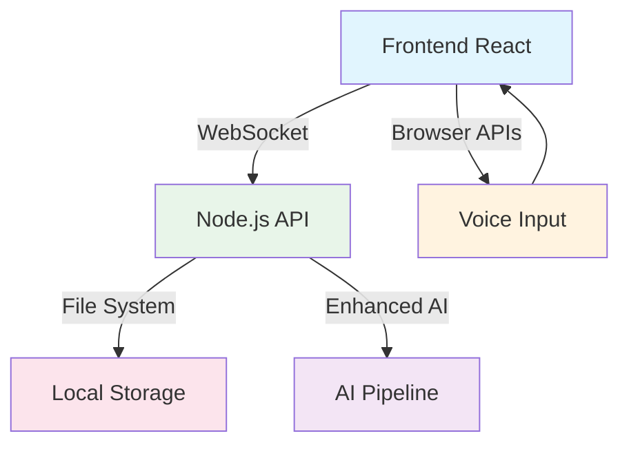
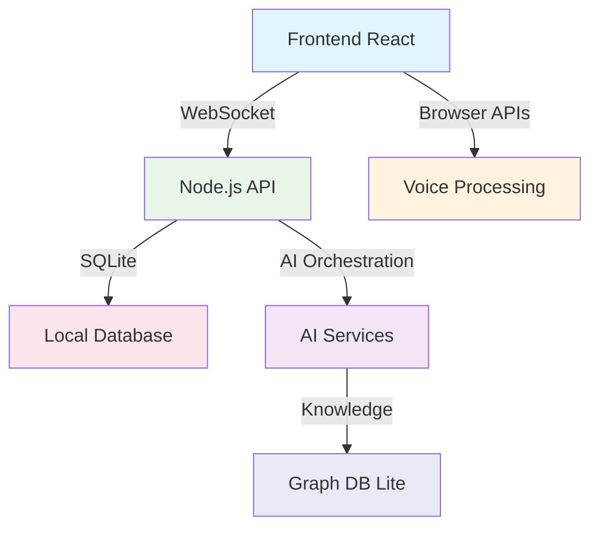
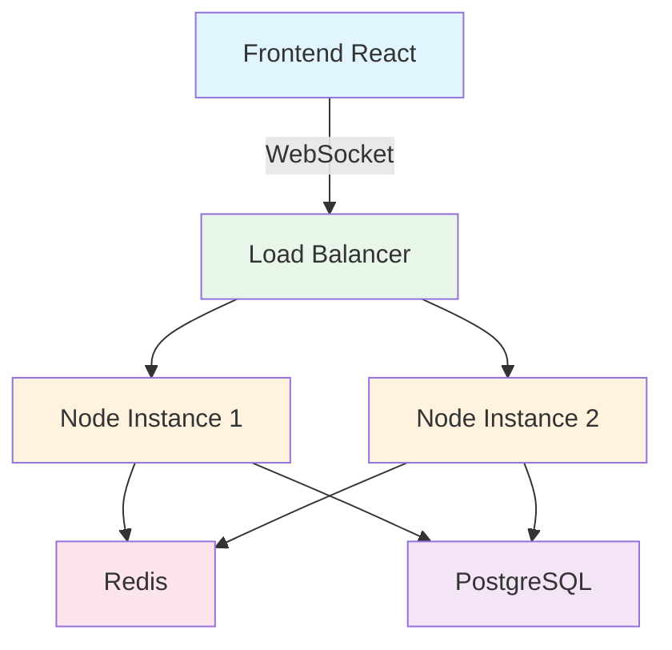

# Evolução Gradual do Papo Social - Do Planejamento ao Produto

## Atualização Importante: Abordagem Documentation-First

### Nova Abordagem

Identificamos que implementar código antes de ter documentação clara estava criando ineficiências. Nossa nova abordagem:

1. **Documentação Completa Primeiro**
   - Arquitetura técnica detalhada
   - Modelo de dados definido
   - Fluxos de usuário mapeados
   - Decisões tecnológicas justificadas

2. **Validação com Stakeholders**
   - Review da documentação
   - Feedback antecipado
   - Alinhamento de expectativas

3. **Implementação Focada**
   - Desenvolvimento guiado pela documentação
   - Escopo claramente definido
   - Métricas de sucesso estabelecidas

### Benefícios da Abordagem

- **Redução de Retrabalho**: Menos código descartado
- **Maior Clareza**: Visão compartilhada entre todos os envolvidos
- **Decisões Informadas**: Escolhas técnicas justificadas
- **Onboarding Facilitado**: Novos membros entendem o contexto rapidamente
- **Melhor Uso de IA**: Ferramentas como Copilot são mais eficazes com contexto claro

## Visão Geral

Este documento detalha a evolução planejada do Papo Social, focando em uma abordagem gradual que prioriza entrega de valor com complexidade controlada.

## MVP 1: Base Fundamental

### Arquitetura

### Decisões Técnicas
1. **Frontend**
   - React com TypeScript
   - Tailwind CSS para UI rápida
   - Axios para chamadas HTTP
   - Context API para estado local

2. **Backend**
   - Node.js + Express
   - Sistema de arquivos para persistência
   - JWT para autenticação simples
   - Logger básico (Winston)

3. **Dados**
   - Estrutura de arquivos JSON
   - Backup manual inicial
   - Sem necessidade de migrations

### Trade-offs Aceitos
- ✅ Limitação de usuários simultâneos
- ✅ Sem tempo real (polling se necessário)
- ✅ Restart perde estado em memória
- ✅ Backup manual dos arquivos

### Critérios de Sucesso
- [ ] API REST funcional
- [ ] CRUD básico funcionando
- [ ] Autenticação implementada
- [ ] Integração com IA respondendo

## MVP 2: Interatividade Aprimorada

### Arquitetura

### Decisões Técnicas
1. **Real-time**
   - Socket.io para WebSockets
   - Eventos tipados
   - Reconexão automática
   - Broadcast seletivo

2. **Processamento de Voz**
   - Web Speech API
   - MediaRecorder API
   - AudioContext para feedback
   - Fallback para texto

3. **AI Pipeline**
   - Fila de processamento simples
   - Retry mechanism
   - Timeout handling
   - Respostas parciais

### Trade-offs Aceitos
- ✅ Limite de histórico em memória
- ✅ Sem processamento distribuído
- ✅ Reconhecimento de voz dependente do browser
- ✅ Latência em picos de uso

### Critérios de Sucesso
- [ ] Chat em tempo real fluido
- [ ] Voz para texto funcionando
- [ ] Feedback visual de estados
- [ ] Tratamento de erros robusto

## MVP 3: Expansão Controlada

### Arquitetura

### Decisões Técnicas
1. **Persistência**
   - SQLite com TypeORM
   - Migrations automatizadas
   - Backups agendados
   - Índices otimizados

2. **Knowledge Graph**
   - SQLite + JSON para grafos
   - Consultas via SQL
   - Cache em memória
   - Exportação/Importação

3. **AI Melhorada**
   - Múltiplos modelos
   - Fallback chain
   - Caching de respostas
   - Análise de sentimento

### Trade-offs Aceitos
- ✅ Limite de complexidade de queries
- ✅ Escalabilidade vertical apenas
- ✅ Sem sharding de dados
- ✅ Processamento síncrono

### Critérios de Sucesso
- [ ] Queries complexas < 100ms
- [ ] Backup/Restore testado
- [ ] Grafos funcionais
- [ ] AI pipeline resiliente

## Versão 1.0: Escalabilidade Sob Demanda

### Arquitetura

### Decisões Técnicas
1. **Infraestrutura**
   - Load Balancer (NGINX)
   - Redis para sessões/cache
   - PostgreSQL + PgBouncer
   - Monitoramento (PM2)

2. **Escalabilidade**
   - Múltiplas instâncias
   - Sticky sessions
   - Connection pooling
   - Health checks

3. **Resiliência**
   - Circuit breakers
   - Rate limiting
   - Graceful degradation
   - Logs centralizados

### Gatilhos para Migração
1. **Redis Necessário Quando:**
   - > 1000 usuários simultâneos
   - Latência de sessão > 100ms
   - Perda de estado frequente
   - Necessidade de Pub/Sub

2. **PostgreSQL Necessário Quando:**
   - Dados > 10GB
   - Queries complexas lentas
   - Necessidade de transações
   - Backup em tempo real

### Critérios de Sucesso
- [ ] Zero downtime deploys
- [ ] Latência < 200ms
- [ ] 99.9% uptime
- [ ] Escalabilidade testada

## Princípios Revisados de Evolução

### 1. Documentação Como Produto
- Documentação tratada como entregável de valor
- Mantida atualizada com o desenvolvimento
- Visualizável e acessível a todos
- Base para decisões técnicas e de produto

### 2. Dados Como Ativo Estratégico
- Modelagem cuidadosa desde o MVP1
- MongoDB como fundação escalável
- Governança de dados desde o início
- Analytics para informar evolução

### 3. Métricas Guiam Mudanças
- Monitoramento desde MVP1
- Decisões baseadas em dados
- KPIs claros por fase
- Feedback dos usuários

### 4. Segurança e Qualidade
- Testes desde o início
- Segurança by design
- Code review rigoroso
- Logs e auditoria

### 5. Experiência do Usuário
- Performance percebida
- Feedback constante
- Graceful degradation
- Consistência visual

## Conclusão

Esta abordagem documentation-first permite:
1. Entrega mais eficiente de valor
2. Validação antecipada de premissas
3. Controle de complexidade
4. Base sólida para crescimento

O foco em documentação e dados como ativos estratégicos desde o início nos permitirá construir um produto mais coeso, evoluir com confiança e acumular valor em cada iteração.
