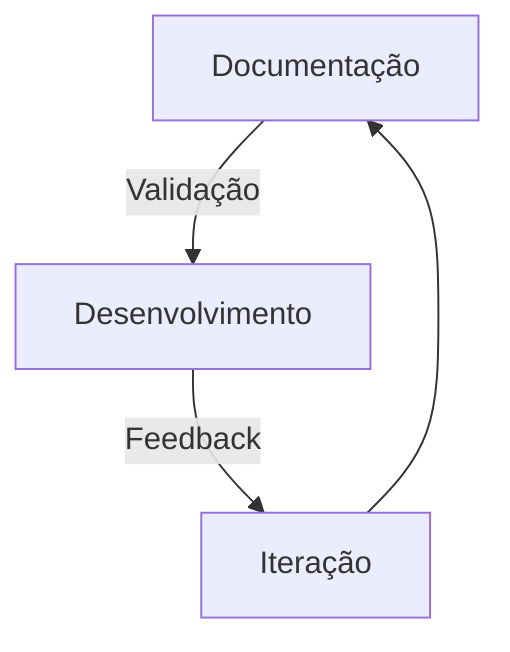

# Roadmap do Papo Social 

## Abordagem Documentation-First 

Nossa estratégia de desenvolvimento prioriza documentação clara antes da implementação para garantir eficiência e alinhamento.

## Fases de Desenvolvimento

### MVP 1: Base Fundamental
- Frontend React/Next.js com Tailwind CSS
- Backend FastAPI (Python)
- CrewAI para orquestração de agentes
- Persistência em arquivos JSON/SQLite
- Integração inicial com OpenAI

### MVP 2: Interatividade e Performance
- Comunicação em tempo real
- Primeiros componentes Rust para processamento de áudio
- Pipeline de voz com WebAssembly no cliente
- Melhorias na AI Pipeline com CrewAI
- Feedback visual aprimorado

### MVP 3: Escalabilidade com Componentes Críticos
- Banco de dados estruturado (PostgreSQL)
- Componentes de cache em Rust
- Knowledge Graph integrado
- Multiple AI models orchestration
- Análise de sentimento e contexto

### Versão 1.0: Produto Completo
- Arquitetura híbrida Python/Rust otimizada
- WebAssembly para UX responsiva
- Escalabilidade horizontal
- Sistema resiliente
- Monitoramento avançado

## Princípios de Produto

- Experiência do usuário como prioridade
- Performance onde importa (Rust para componentes críticos)
- Segurança e privacidade by design
- Métricas guiando decisões
- Testes automatizados

## Para Desenvolvedores

Veja nosso [Guia de Contribuição](../CONTRIBUTING.md) para entender como participar do desenvolvimento.
