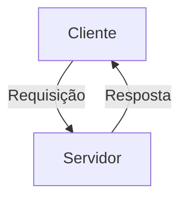

# Configuração do Visualizador de Documentação

## Sobre o Docsify

O projeto Papo Social utiliza [Docsify](https://docsify.js.org/) para visualização da documentação. O Docsify é um gerador de sites de documentação minimalista, que não gera arquivos estáticos, mas carrega e analisa seus arquivos markdown sob demanda.

## Configuração Local

### Pré-requisitos
- Node.js 14+ instalado

### Instalação do Docsify CLI

```bash
# Instalação global do docsify-cli
npm install -g docsify-cli

# Verificar a instalação
docsify -v
```

### Iniciando o servidor de documentação

```bash
# A partir da raiz do projeto
docsify serve docs

# OU usando o script do projeto
./start-project.sh
# Depois escolha a opção 1
```

O servidor ficará disponível em: http://localhost:3000

## Estrutura da Documentação

```
docs/
├── index.html               # Configuração do Docsify
├── README.md                # Página inicial
├── _sidebar.md              # Barra lateral de navegação
├── planning/                # Documentação de planejamento
│   └── MVP_EVOLUTION.md
├── architecture/            # Detalhes arquiteturais
│   └── OVERVIEW.md
│   └── TECH_STACK.md
├── database/                # Modelagem de dados
│   └── DATA_MODEL.md
├── CONTRIBUTING.md          # Guia de contribuição
└── GETTING_STARTED.md       # Como iniciar com o projeto
```

## Personalização

### Alterando a Barra Lateral

Edite o arquivo `_sidebar.md` para modificar a navegação:

```markdown
- [Link para Seção](caminho/arquivo.md)
- [Grupo]
  - [Subitem](caminho/arquivo2.md)
```

### Usando Diagramas Mermaid 

Docsify suporta diagramas [Mermaid](https://mermaid-js.github.io/), que já estão configurados:

```markdown

```

## GitHub Pages

Nossa documentação é automaticamente publicada em GitHub Pages usando GitHub Actions:

1. Ao fazer push para a branch `main`
2. O workflow `.github/workflows/docs.yml` é acionado
3. A documentação é copiada para a branch `gh-pages`
4. Fica disponível em `https://seu-usuario.github.io/papo-comtxae`

## Troubleshooting

### Problema: Alterações não aparecem

**Solução**: Tente:
- Limpar o cache do navegador
- Reiniciar o servidor docsify
- Verificar se os arquivos foram salvos

### Problema: Mermaid não renderiza

**Solução**: Verifique:
- Sintaxe do diagrama
- Se há espaços extras antes dos blocos de código
